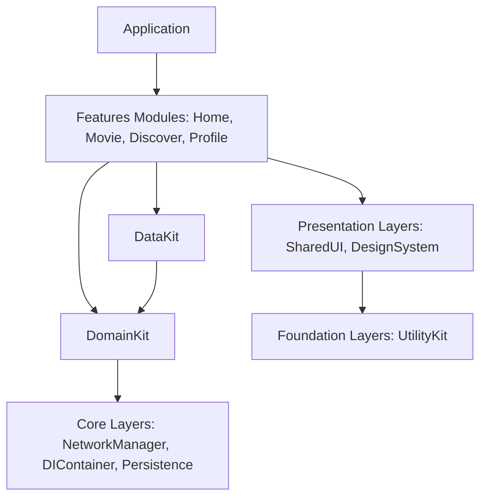

# 🎬 MovieHub iOS Application

[](https://developer.apple.com/swift/)
[](https://developer.apple.com/ios/)
[](https://github.com/realm/SwiftLint)
[]()

**MovieHub** is a premium, performance-optimized iOS application showcasing movie databases, paginated lists, rich movie details, and interactive reviews. Built entirely with **UIKit** using programmatic layout, the application follows strict **Clean Architecture** principles and incorporates the **VIPER** design pattern for dynamic feature modules.

---

## 🌟 Key Features

- **Dynamic Home Dashboard**: Features custom horizontal collections presenting movies by section (*Now Playing*, *Popular*, *Top Rated*, *Upcoming*).
- **VIPER "See All" List Pagination**: Smooth 2-column grid displaying categorized lists, powered by infinite scroll pagination and custom refresh controls.
- **Immersive Movie Details**: High-fidelity detail screens featuring interactive statistics badges, genre-tag scroll containers, and safe-area stretching hero backdrops.
- **Paginated Movie Reviews**: Live user review lists featuring smooth paging and dynamic cell height computations.
- **Dark Mode Exclusive UX**: Curated high-contrast color scheme tailored specifically for theater-like experiences.
- **Premium Skeleton/Shimmer Loaders**: Adaptive, dark-theme aligned skeleton state shimmers that cover content overlays gracefully during loading transitions.
- **Pulse Debug Console**: Diagnostic HUD with network log inspecting, triggered on demand via a standard hardware shake gesture.

---

## 🏗️ Architecture & Modular Structure

The codebase is split into local Swift Package Manager (SPM) modules to enforce physical separation of concerns and minimize compile times.



### 1. Layers Breakdown

| Layer | Module / Directory | Description |
| :--- | :--- | :--- |
| **Application** | `Application/` | App entry points, window configuration, and root TabBar styling. |
| **Features** | `Features/` | High-level modular feature components containing VIPER structures (Home, Movie, Discover, Profile). |
| **Domain** | `Domain/DomainKit` | Contains enterprise-level business entities (`Movie`, `MovieReview`) and decoupled use cases (`GetMovieDetailUseCase`, etc.). Zero dependency on UIKit or external database layers. |
| **Data** | `Data/DataKit` | Gateway implementations, network service request mappers, and offline-first decoration handling. |
| **Presentation** | `Presentation/DesignSystem`<br>`Presentation/SharedUI` | Common design system tokens (colors, icons) and shared UI blocks (shimmer loaders, Custom remote UIImageViews, Toast). |
| **Core** | `Core/NetworkManager`<br>`Core/Persistence`<br>`Core/DIContainer` | URLSession proxies, localized storage, and Dependency Injection registers. |
| **Foundation** | `Foundation/UtilityKit` | Programmatic layout anchors, logging utilities, and basic language helpers. |

---

## ⚙️ VIPER Pattern Integration

Feature modules like **Home** and **See All Movie List** are structured using the VIPER pattern for complete testability and separation of logic:

```
                  ┌───────────────┐
                  │   Router      │◄────────┐
                  └───────▲───────┘         │
                          │                 │ (Route Transition)
                          ▼                 │
┌───────────┐     ┌───────────────┐         │
│   View    │◄───►│   Presenter   ├─────────┘
└───────────┘     └───────▲───────┘
                          │
                          ▼
                  ┌───────────────┐
                  │  Interactor   │◄───────► [ Use Cases / Gateway ]
                  └───────────────┘
```

1. **View**: Passive interface representing UI states (`HomeViewController`, `MovieListViewController`).
2. **Interactor**: Handles business logic fetches via domain use cases (`HomeInteractor`, `MovieListInteractor`).
3. **Presenter**: Connects the View, Interactor, and Router. Contains presentation state machine controls.
4. **Entity**: Clean domain model representations passed between Interactor and Presenter.
5. **Router**: Resolves module dependencies and manages view controller transitions (`HomeRouter`, `MovieListRouter`).

---

## 🛠️ Tech Stack & Libraries

- **UI Framework**: UIKit (100% Programmatic Auto Layout via Custom Anchors engine)
- **Data Caching & Image Loading**: [Kingfisher](https://github.com/onevcat/Kingfisher) (leveraging downsampled processing)
- **Debugging & Diagnostics**: [Pulse Network Inspector](https://github.com/kean/Pulse) (proxies DEBUG network transactions)
- **Linter Engine**: SwiftLint (strict styling configuration)

---

## 🔍 Diagnostics & Network Inspection (Pulse)

The app integrates a headless network inspector. To open the Console Console HUD:
- **On a Device**: Shake your physical phone.
- **On the Simulator**: Press `Ctrl + Cmd + Z` to trigger the system shake gesture.

```swift
// Triggered on UIWindow Shake Events (SharedUI Target)
extension UIWindow {
    open override func motionEnded(_ motion: UIEvent.EventSubtype, with event: UIEvent?) {
        if motion == .motionShake {
            NotificationCenter.default.post(name: .didTriggerShakeGesture, object: nil)
        }
    }
}
```

---

## 🚀 Building and Running

### Prerequisites

- macOS Sonoma or later
- Xcode 15.0+
- Swift 5.9+
- Simulator/iOS Device running iOS 16.0+

### Setup Steps

1. **Clone the Repository**:
   ```bash
   git clone https://github.com/rahmat3nanda/MovieHub.git
   cd MovieHub
   ```

2. **Open the Project**:
   Double-click `MovieHub.xcodeproj` to launch Xcode. Packages and dependencies resolve automatically via Swift Package Manager.

3. **Select Scheme**:
   Choose the **MovieHub** scheme and target an iOS Simulator of your choice (e.g., iPhone 15).

4. **Run**:
   Press `Cmd + R` to compile and run.

### Running Lint Verification

The project is fully SwiftLint compliant. Verify conforming style rules:
```bash
swiftlint
```

---

## 📝 License

This project is licensed under the MIT License - see the LICENSE file for details.
